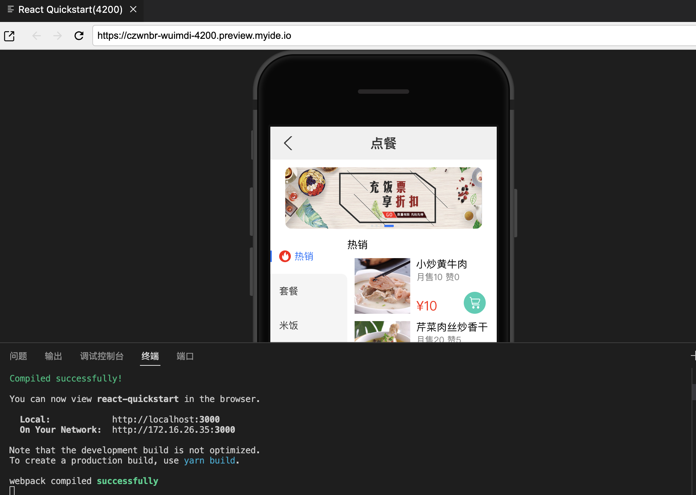
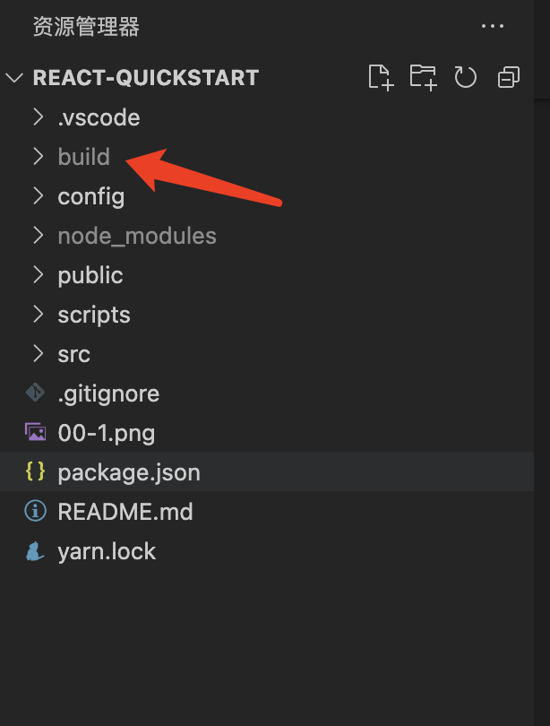

# 项目说明
## 本项目来源于[《腾讯云 Cloud Studio 实战训练营》](https://marketing.csdn.net/p/06a21ca7f4a1843512fa8f8c40a16635)的参赛作品，该作品在腾讯云 [Cloud Studio](https://www.cloudstudio.net/?utm=csdn) 中运行无误。

这是一个用 IDE [Cloud Studio](https://www.cloudstudio.net/?utm=csdn) 快速搭建，并开发还原一个移动端 React H5 的简版点餐系统页面，从 0 到 1 体验云 IDE 给我们带来的优势，不需要装各种环境，简单易用，开箱即可上手。

## 相关技术栈

React + less + webpack

## 项目运行

    yarn install

## 项目启动

    yarn start

## 启动成功可以看到如下

## 项目打包

    yarn build

## 打包成功，可以看到会出现一个build文件夹，其内容就是打包的结果
